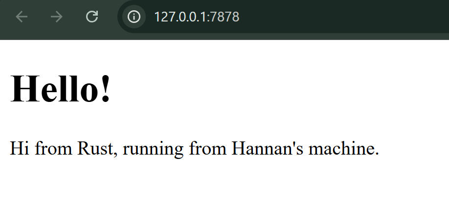
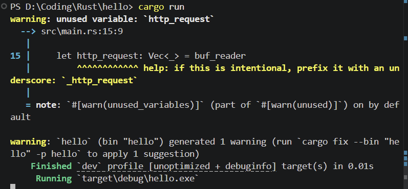
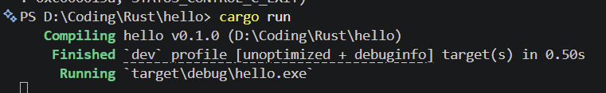
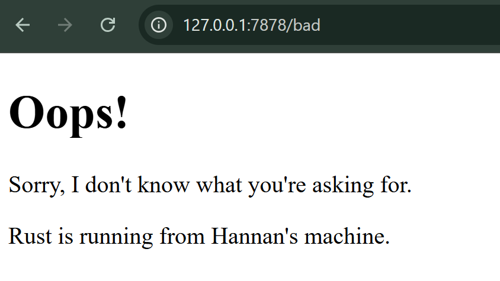

# Commit 1 Reflection Notes

Pada milestone 1, Fungsi `handle_connection` bertugas untuk memproses koneksi TCP yang masuk dengan cara:
- Menerima `TcpStream` sebagai input.
- Menggunakan `bufReader` untuk meningkatkan efisiensi dari pembacaan data dari stream.
- Membagi dan membaca data baris per baris dan berhenti jika menemukan baris kosong (dalam HTTP berarti akhir dari header).
- Semua baris header disimpan di `Vec` dan di print ke terminal.

# Commit 2 Reflection Notes

Pada milestone 2, hal yang saya pelajari dari kode baru di fungsi `handle_connection`:
- Pada milestone 1, kita hanya menerima/mengambil data dari browser. Pada milestone ini, kita memberikan response dengan mengirim hello.html
- Kita kirim dengan status 200 OK. variable `response` berguna sebagai formatting ke dalam bentuk HTTP Response.

*Screenshot browser*  

*Screenshot terminal*  

# Commit 3 Reflection Notes

Pada milestone 3, untuk memisahkan route, kita bisa membuat if condition pada `status_line`, dimana jika:
- browser di url yang benar (tanpa tambahan /xxxx), maka `request_line`nya bakal berbentuk `GET / HTTP/1.1`. kita buat variabel filename untuk nama file yang perlu dikirim dan jika sesuai `request_line`, maka akan dikirim `hello.html` dengan `status_line` *200 OK*.
- Jika request_linenya tidak sesuai, dengan menggunakan `else`, kita buat variable filenamenya menjadi `404.html` dan `status_line`nya *404 NOT FOUND*. 

*Screenshot browser dengan url /bad*  

*Screenshot terminal*  

# Commit 4 Reflection Notes

Pada milestone 4, browser pada url normal menunggu url dengan /sleep selesai diload. Ini terjadi karena servernya berjalan di single thread. Jadi harus menunggu /sleep nya selesai baru bisa. Singkatnya:
- ke url dengan /sleep, maka akan sleep selama 10 detik.
- ketika ke url normal, namun masih sleep. Maka harus menunggu sampai selesai baru bisa load.

# Commit 5 Reflection Notes

Pada milestone 5, kita menggunakan ThreadPool. Hal ini mengubah server dari sequential jadi asinkron. Di dalam kode:
- Kita buat 4 thread yang siap dipakai dan dalam kondisi idle
- Ketika ada request masuk dari browser, request masuk ke antrian (task queue)
- Thread yang idle akan ngambil tugasnya, jika salah satu mengambil /sleep, maka jika kita buka url normal. Tidak akan terganggu karena ada thread lain yang akan mengambilnya.